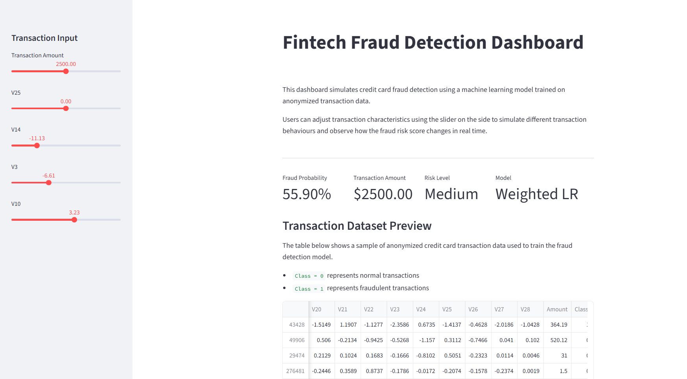
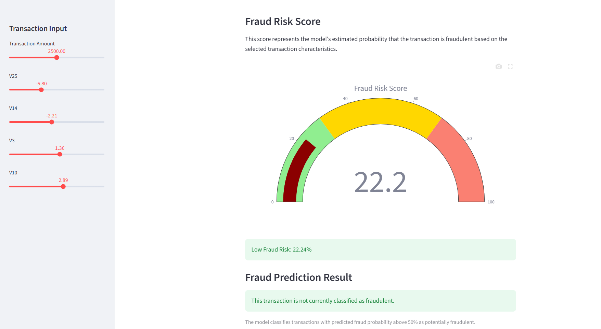
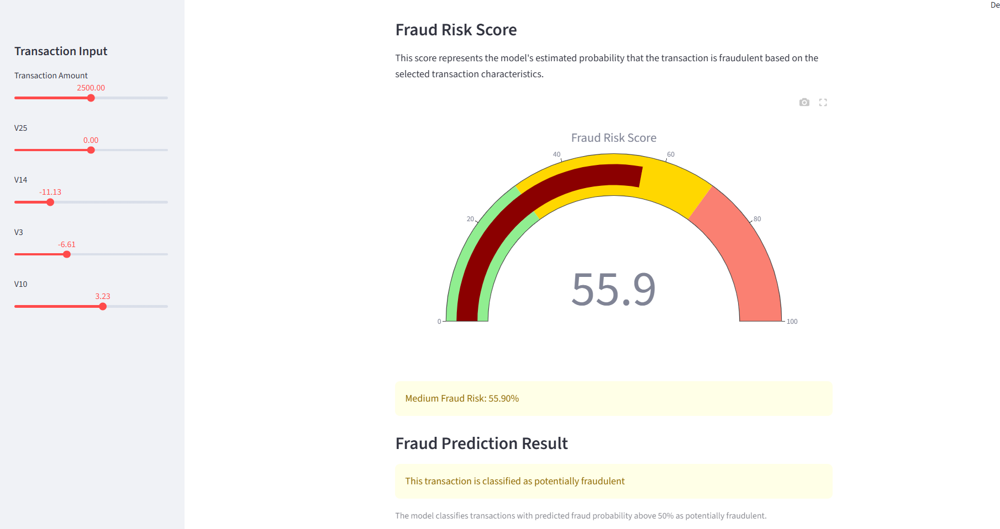

# Fraud Detection Dashboard
## Project Overview

This project uses machine learning to detect potential fraudulent credit card transactions through an interactive fintech dashboard built with Streamlit.

The application allows users to simulate transaction behaviour, analyse fraud risk, and explore how different transaction features influence fraud detection.

## Features

- Interactive fraud risk dashboard
- Weighted Logistic Regression model
- Real-time fraud probability scoring
- Explainable AI fraud signals
- Adjustable transaction feature controls
- Fraud risk visualization
- Streamlit web application interface

## Tech Stack

- Python
- Pandas
- Scikit-learn
- Streamlit
- Matplotlib
- Plotly

## Machine Learning Approach

The project uses a Weighted Logistic Regression model to address the class imbalance problem commonly found in fraud detection datasets.

Since fraudulent transactions are rare, class weighting was used to improve fraud recall and reduce false negatives. The dashboard also includes feature contribution analysis to improve model explainability and interpretability.

## Dashboard Preview

### Main Dashboard


### Low Risk Transaction Example


### High Risk Transaction Example


## How To Run

1. Clone the repository

```bash
git clone <your-github-link>
```

2. Install dependencies

```bash
pip install -r requirements.txt
```

3. Run the Streamlit app

```bash
streamlit run app/app.py
```